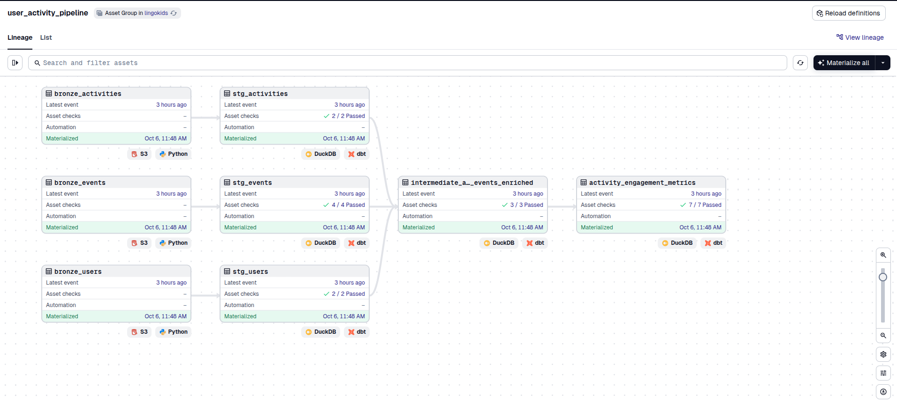
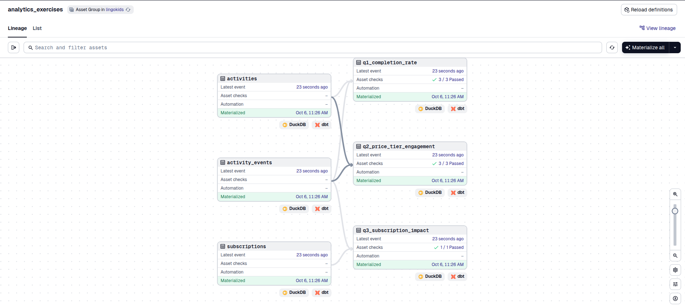

# Lingokids Data Engineering & Analytics Engineering Assessment

Welcome! This repository contains a complete data pipeline built with modern data engineering tools. This project demonstrates ETL/ELT best practices, including orchestration, transformation, testing, and incremental processing.

---

## 📋 Table of Contents

- [Overview](#overview)
- [Tech Stack](#tech-stack)
- [Prerequisites](#prerequisites)
- [Getting Started](#getting-started)
- [Running the Pipeline](#running-the-pipeline)
- [Exploring the Data](#exploring-the-data)
- [Project Structure](#project-structure)
- [Learn More](#learn-more)

---

## 🎯 Overview

This project implements a **medallion architecture** (bronze → silver → gold) data pipeline that:

1. **Ingests** raw JSON files from MinIO (S3-compatible object storage)
2. **Merges** small files into larger consolidated files (solving the "small file problem")
3. **Transforms** data through multiple layers using dbt
4. **Tests** data quality at every stage
5. **Serves** aggregated metrics for analytics

The repository is split into two parts:
- **Data Engineering (DE)**: The main pipeline handling event data ingestion and transformation
- **Analytics Engineering (AE)**: SQL-based analytics answering specific business questions

---

## 🛠️ Tech Stack

### **Dagster** - Data Orchestration
[Dagster](https://dagster.io/) is a modern data orchestrator that manages the entire pipeline. It provides:
- Asset-based development (treating data tables as first-class assets)
- Dependency management and lineage tracking
- Built-in testing and data quality checks
- A beautiful web UI for monitoring and debugging

### **dbt (data build tool)** - Data Transformation
[dbt](https://www.getdbt.com/) handles SQL-based transformations with:
- Version-controlled SQL models
- Incremental materialization strategies
- Built-in testing framework
- Documentation generation

### **DuckDB** - Analytics Database
[DuckDB](https://duckdb.org/) is an embedded analytical database that:
- Runs entirely in-process (no separate server needed)
- Provides extremely fast analytical queries
- Works directly with files (JSON, Parquet, CSV)
- Requires zero configuration

### **MinIO** - Object Storage
[MinIO](https://min.io/) is an S3-compatible object storage that:
- Simulates cloud storage locally
- Allows for realistic production-like development
- Runs in Docker for easy setup

---

## 📦 Prerequisites

Before you begin, ensure you have the following installed:

### 1. **uv** - Python Package Manager
[uv](https://docs.astral.sh/uv/) is an extremely fast Python package installer and resolver written in Rust. It's similar to pip but significantly faster and more reliable.

**Why uv?**
- 10-100x faster than pip
- Better dependency resolution
- Built-in virtual environment management
- Lock file support for reproducible builds

**Installation:**
Follow the [official uv installation guide](https://docs.astral.sh/uv/getting-started/installation/)

### 2. **Docker & Docker Compose**
Docker is required to run MinIO (our S3-compatible storage).

**Installation:**
Follow the [official Docker installation guide](https://docs.docker.com/get-docker/) for your operating system.

### 3. **DuckDB CLI** (Optional but recommended)
The DuckDB CLI allows you to explore the database interactively.

**Installation:**
Follow the [official DuckDB installation guide](https://duckdb.org/docs/installation/)

---

## 🚀 Getting Started

Follow these steps to set up and run the pipeline:

### Step 1: Clone the Repository
```bash
git clone https://github.com/facundoroot/lingokids-pipelines.git
cd lingokids-pipelines
```

### Step 2: Start MinIO (S3 Storage)

MinIO will simulate cloud object storage and automatically load the raw data files.

```bash
docker compose up -d
```

This command:
- Starts MinIO server on ports 9000 (API) and 9001 (Web UI)
- Automatically uploads raw JSON files to three buckets:
  - `raw-events` - User activity events
  - `raw-users` - User metadata
  - `raw-activities` - Activity catalog

**Check MinIO UI** (optional):
- Navigate to http://localhost:9001
- Login credentials:
  - Username: `lingokidsadmin`
  - Password: `lingokidsadmin`

### Step 3: Install Python Dependencies

Using **uv** (recommended):
```bash
uv sync
```

This creates a virtual environment in `.venv/` and installs all dependencies with locked versions.

Or using **pip**:
```bash
python3 -m venv .venv
source .venv/bin/activate  # On Windows: .venv\Scripts\activate
pip install -e ".[dev]"
```

### Step 4: Activate Virtual Environment

```bash
# macOS/Linux
source .venv/bin/activate

# Windows
.venv\Scripts\activate
```

You should see `(.venv)` in your terminal prompt.

### Step 5: Install dbt Dependencies

The project uses `dbt-utils` for additional test macros. Install the required dbt packages:

```bash
cd dbt
dbt deps
cd ..
```

This will download `dbt-utils` to `dbt/dbt_packages/` (required for Dagster to parse the project).

### Step 6: Start Dagster

Launch the Dagster development server:

```bash
dg dev
```

You should see:
```
Serving dagster-webserver on http://127.0.0.1:3000 in process [...]
```

Open your browser to **http://localhost:3000** to see the Dagster UI.

---

## 🎮 Running the Pipeline

Once Dagster is running, you can materialize (execute) the data pipeline through the UI.

### Understanding the Asset Groups

The pipeline is organized into **two groups**:

#### 1️⃣ **user_activity_pipeline** (Data Engineering)

This group contains the main ETL pipeline:

- **Bronze Layer** (Python assets):
  - `bronze_events` - Merges raw event files from MinIO
  - `bronze_users` - Merges raw user files from MinIO
  - `bronze_activities` - Merges raw activity files from MinIO

- **Silver Layer** (dbt staging views):
  - `stg_events` - Cleaned and typed event data
  - `stg_users` - Cleaned user metadata
  - `stg_activities` - Cleaned activity catalog

- **Silver Layer** (dbt intermediate tables):
  - `intermediate_activity_events_enriched` - Events joined with user and activity metadata

- **Gold Layer** (dbt mart tables):
  - `activity_engagement_metrics` - Daily aggregated KPIs by country, OS, app version, etc.

#### 2️⃣ **analytics_exercises** (Analytics Engineering)

This group contains the analytics questions:

- **Seeds** (CSV data):
  - `activities` - Activity reference data
  - `activity_events` - Event log
  - `subscriptions` - Subscription events

- **Analytics Models** (dbt views):
  - `q1_completion_rate` - Completion rate by theme
  - `q2_price_tier_engagement` - Engagement metrics by price tier
  - `q3_subscription_impact` - Activity behavior before/after subscription

### How to Run

#### Visual Guide: Navigating Asset Groups

##### Option 1: Run the Data Engineering Pipeline

1. Navigate to **Assets** in the Dagster UI
2. In the **search/filter bar** at the top, type: `group:user_activity_pipeline`
3. Click **"View lineage"** to see the full asset graph
4. Click **"Materialize all"** button in the top right

You should see the pipeline execute through the medallion architecture:



This pipeline will:
- Download and merge files from MinIO → bronze layer (Python assets with S3 icons)
- Transform raw data → staging views (dbt models)
- Enrich events with user/activity metadata → intermediate tables
- Aggregate daily metrics → final mart table

##### Option 2: Run the Analytics Exercises

1. In the search/filter bar, type: `group:analytics_exercises`
2. Click **"View lineage"** to see the analytics graph
3. Click **"Materialize all"**

You should see the seeds load and the three analytics questions execute:



This will:
- Load CSV seed data (activities, activity_events, subscriptions)
- Run Q1: Completion rate by theme
- Run Q2: Price tier engagement metrics
- Run Q3: Subscription impact analysis

##### Option 3: Run Individual Assets

You can also click on any individual asset in the graph view and click **"Materialize"** to run just that asset and its upstream dependencies.

### Monitoring Execution

- **Real-time logs**: Click on any running asset to see live logs
- **Asset checks**: After materialization, dbt tests run automatically
- **Test results**: Click on the "Checks" tab to see test results (green = pass, red = fail)

---

## 🔍 Exploring the Data

After running the pipeline, you can explore the data using DuckDB.

### What is DuckDB?

DuckDB is an **embedded analytical database** - think of it as "SQLite for analytics". It:
- Runs entirely in-process (no server to manage)
- Stores data in a single file (`lingokids.duckdb`)
- Provides blazing-fast analytical queries
- Supports rich SQL features (window functions, CTEs, JSON parsing, etc.)

### Locating the Database

The DuckDB database is located at:
```
dbt/warehouse/lingokids.duckdb
```

### Opening the Database

Navigate to the dbt directory and open DuckDB:

```bash
cd dbt/warehouse
duckdb lingokids.duckdb
```

You'll see the DuckDB prompt:
```
v1.x.x
Enter ".help" for usage hints.
D
```

### Useful Commands

#### List all tables and views:
```sql
SHOW TABLES;
```

#### Describe a table schema:
```sql
DESCRIBE main.activity_engagement_metrics;
```

#### View table row count:
```sql
SELECT COUNT(*) FROM main.activity_engagement_metrics;
```

### Example Queries

You can run queries just like you would with any other SQL database. For example, to view the aggregated engagement metrics:

```sql
SELECT * FROM main.activity_engagement_metrics LIMIT 10;
```

To see the analytics exercise results:

```sql
-- Q1: Completion rate by theme
SELECT * FROM main.q1_completion_rate;

-- Q2: Price tier engagement
SELECT * FROM main.q2_price_tier_engagement;

-- Q3: Subscription impact
SELECT * FROM main.q3_subscription_impact;
```

### Exiting DuckDB
```sql
.quit
```
Or press `Ctrl+D`

---

## 📊 Data Quality & Testing

This project includes comprehensive data quality tests using dbt.

### Where to View Tests

In the Dagster UI:
1. Navigate to any asset (e.g., `activity_engagement_metrics`)
2. Click on the **"Checks"** tab
3. You'll see all tests that run on that asset

### Types of Tests

#### 1. **Schema Tests** (defined in `schema.yml` files)
- `not_null` - Ensures critical columns have no null values
- `unique` - Ensures columns contain unique values
- `accepted_range` - Validates numeric columns are within expected ranges
- `unique_combination_of_columns` - Ensures composite keys are unique

#### 2. **Model-Level Tests**
- Uniqueness of the grain (date + country + OS + version + subscription + activity type)
- Completion rate bounds (0-1 for intermediate, 0-100 for AE questions)

### Running Tests Manually

You can also run dbt tests from the command line:

```bash
cd dbt

# Run all tests
dbt test

# Run tests for a specific model
dbt test --select activity_engagement_metrics

# Run tests for a specific group
dbt test --select user_activity_pipeline
```

Test results are stored in:
```
dbt/target/compiled/lingokids/models/.../[test_name].sql
```

---

## 📁 Project Structure

```
lingokids/
├── dbt/                                    # dbt project
│   ├── models/
│   │   ├── staging/                        # Silver layer - cleaned data
│   │   │   ├── stg_events.sql
│   │   │   ├── stg_users.sql
│   │   │   ├── stg_activities.sql
│   │   │   └── sources.yml                 # Bronze source definitions
│   │   ├── intermediate/                   # Silver layer - enriched data
│   │   │   ├── intermediate_activity_events_enriched.sql
│   │   │   └── schema.yml
│   │   ├── marts/                          # Gold layer - aggregated metrics
│   │   │   ├── activity_engagement_metrics.sql
│   │   │   └── schema.yml
│   │   ├── ae/                             # Analytics exercises
│   │   │   ├── q1_completion_rate.sql
│   │   │   ├── q2_price_tier_engagement.sql
│   │   │   ├── q3_subscription_impact.sql
│   │   │   └── schema.yml
│   │   └── groups.yml                      # Group definitions
│   ├── seeds/                              # CSV reference data for AE
│   │   ├── activities.csv
│   │   ├── activity_events.csv
│   │   └── subscriptions.csv
│   ├── data/
│   │   └── bronze/                         # Merged files from Dagster
│   │       ├── bronze_events.json
│   │       ├── bronze_users.json
│   │       └── bronze_activities.json
│   ├── warehouse/
│   │   └── lingokids.duckdb               # DuckDB database file
│   ├── dbt_project.yml
│   └── packages.yml                        # dbt dependencies
│
├── src/lingokids/
│   ├── defs/
│   │   ├── bronze/                         # Bronze layer assets
│   │   │   ├── __init__.py
│   │   │   └── assets.py                   # MinIO → local merge logic
│   │   └── dbt_ingest/
│   │       └── defs.yaml                   # dbt component config
│   └── definitions.py                      # Main Dagster definitions
│
├── scripts/
│   └── init_minio.py                       # MinIO initialization script
│
├── docker-compose.yml                      # MinIO service definition
├── Dockerfile.minio-init                   # MinIO setup container
├── pyproject.toml                          # Python dependencies
└── README.md                               # You are here!
```

### Key Files Explained

- **`bronze/assets.py`**: Python code that downloads files from MinIO buckets and merges them into single files
- **`stg_*.sql`**: Staging models that parse JSON and apply initial transformations
- **`intermediate_*.sql`**: Models that join multiple sources and add business logic
- **`marts/*.sql`**: Final aggregated tables optimized for analytics
- **`dbt_project.yml`**: dbt configuration including materializations and groups
- **`sources.yml`**: Defines bronze layer as sources for lineage tracking
- **`schema.yml`**: Contains test definitions and documentation

---

## 🧩 Key Concepts Demonstrated

### 1. **Small File Problem Solution**
Instead of reading thousands of tiny JSON files (slow!), the bronze layer assets merge them into three consolidated files. This dramatically improves read performance.

### 2. **Incremental Processing**
The intermediate and mart models use incremental materialization:
- First run: Load all historical data
- Subsequent runs: Only process new/changed data
- Strategy: `delete+insert` to handle late-arriving data

### 3. **Data Lineage**
Dagster tracks dependencies between assets:
- Bronze assets → dbt staging models (via temporal dependencies)
- Staging → intermediate → marts (via dbt refs)

### 4. **Separation of Concerns**
- **Dagster**: Orchestration, file handling, dependency management
- **dbt**: SQL transformations, testing, documentation
- **DuckDB**: High-performance analytics queries

### 5. **Medallion Architecture**
- **Bronze**: Raw data, minimal processing
- **Silver**: Cleaned, typed, deduplicated
- **Gold**: Aggregated, business-ready metrics

---

## 🧪 Development Workflow

### Making Changes to dbt Models

1. Edit SQL files in `dbt/models/`
2. Run the model:
   ```bash
   dbt run --select your_model_name
   ```
3. Test the model:
   ```bash
   dbt test --select your_model_name
   ```
4. Or use Dagster UI to materialize the asset

### Making Changes to Python Assets

1. Edit `src/lingokids/defs/bronze/assets.py`
2. Dagster will auto-reload the code
3. Materialize the asset in the UI

### Adding New Tests

Add tests in the relevant `schema.yml` file:
```yaml
models:
  - name: your_model
    columns:
      - name: your_column
        tests:
          - not_null
          - unique
```

---

## 🛑 Troubleshooting

### MinIO containers not starting
```bash
docker compose down
docker compose up -d
```

### DuckDB file locked
Close any open DuckDB sessions. Only one process can write at a time.

### dbt command not found
Make sure you're in the activated virtual environment:
```bash
source .venv/bin/activate
```

### Dagster can't find assets
Restart the Dagster development server:
```bash
# Stop with Ctrl+C, then:
dg dev
```

### Tests failing
Check test details in Dagster UI or run:
```bash
cd dbt
dbt test --select failing_model --store-failures
```

---

## 📚 Learn More

### Dagster
- [Dagster Documentation](https://docs.dagster.io/)
- [Dagster University](https://courses.dagster.io/)
- [Dagster Slack Community](https://dagster.io/slack)

### dbt
- [dbt Documentation](https://docs.getdbt.com/)
- [dbt Best Practices](https://docs.getdbt.com/guides/best-practices)
- [dbt Discourse Community](https://discourse.getdbt.com/)

### DuckDB
- [DuckDB Documentation](https://duckdb.org/docs/)
- [DuckDB SQL Reference](https://duckdb.org/docs/sql/introduction)

### MinIO
- [MinIO Documentation](https://min.io/docs/minio/linux/index.html)

---

## 🎓 Assessment Notes

This project was built as part of the Lingokids technical assessment to demonstrate:

- ✅ Modern data stack proficiency (Dagster, dbt, DuckDB)
- ✅ ETL/ELT pipeline design and implementation
- ✅ Data quality testing and validation
- ✅ Incremental processing strategies
- ✅ SQL and Python skills
- ✅ Documentation and code organization
- ✅ Reproducible development environments

---

## Production Considerations

### What This Project Demonstrates

This local setup simulates a production-like data pipeline with:
- **MinIO as S3**: Cloud object storage patterns
- **Bronze layer merging**: Solves the "small file problem" by consolidating many tiny files into fewer, larger files
- **Medallion architecture**: Progressive refinement from raw → cleaned → aggregated data
- **Incremental processing**: Only process new/changed data on subsequent runs
- **Data quality testing**: Validate data at every layer

The key design choice here is **single-node processing** (Python + DuckDB) for simplicity and cost efficiency at small-to-medium scale.

---

### Production Architecture Trade-offs

The main decision is: **when does distributed processing (Spark/Databricks) make sense vs. single-node (current approach)?**

#### Current Approach: Python + DuckDB
**Best for:**
- Small to medium data volumes
- Team wants fast iteration and low operational overhead
- Budget-conscious projects
- Analytical workloads with modest concurrency

**Limitations:**
- Single-node memory/CPU constraints
- Limited concurrent query users
- No automatic scaling for traffic spikes

#### Spark/Databricks/Glue
**Best for:**
- Large data volumes requiring distributed compute
- High file counts where metadata operations become bottleneck
- Teams already invested in Spark ecosystem
- Need for both batch and streaming in same platform

**Limitations:**
- Higher operational complexity (cluster management, tuning)
- Cost overhead (especially for small workloads)
- Slower for small datasets due to coordination overhead
- Steeper learning curve

---

### When to Choose What

**Stick with single-node (Python/DuckDB):**
- Data volume fits in memory or can be processed in chunks
- File count is high but individual files are tiny
- Batch processing (daily/hourly) is sufficient
- Small team prioritizing velocity over scale

**Move to Spark/Databricks:**
- Data volume requires horizontal scaling
- File sizes are individually large AND numerous
- Need sub-hour latency or streaming capabilities
- Organization already has Spark expertise and infrastructure

**Middle ground (Glue):**
- Need Spark occasionally but don't want to manage clusters
- Unpredictable workload patterns
- Want serverless auto-scaling

---

### Other Production Needs

Beyond the processing engine choice:

**Infrastructure:**
- Containerize Dagster components (webserver, daemon, user-code)
- Use managed databases for metadata (RDS)
- Implement secrets management (AWS Secrets Manager)
- Set up CI/CD with automated testing

**Observability:**
- Centralized logging and alerting
- SLA monitoring for data freshness
- Cost tracking and budget alerts

**Data Quality:**
- Expand testing beyond dbt (Great Expectations, Soda)
- Define data contracts between teams
- Implement data catalogs for discovery

**Optimization:**
- Proper partitioning strategies (by date/region)
- Incremental processing patterns
- Compression (Parquet with appropriate codecs)
- Query result caching where applicable

---

The right production architecture depends on actual constraints: data characteristics, team capabilities, latency requirements, and budget. This project demonstrates solid fundamentals that scale gracefully—you can start here and evolve toward distributed systems only when the data demands it.

---

Thank you for reviewing!
